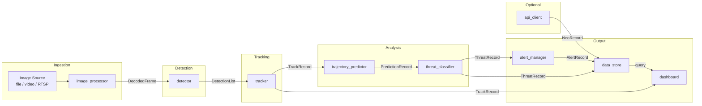
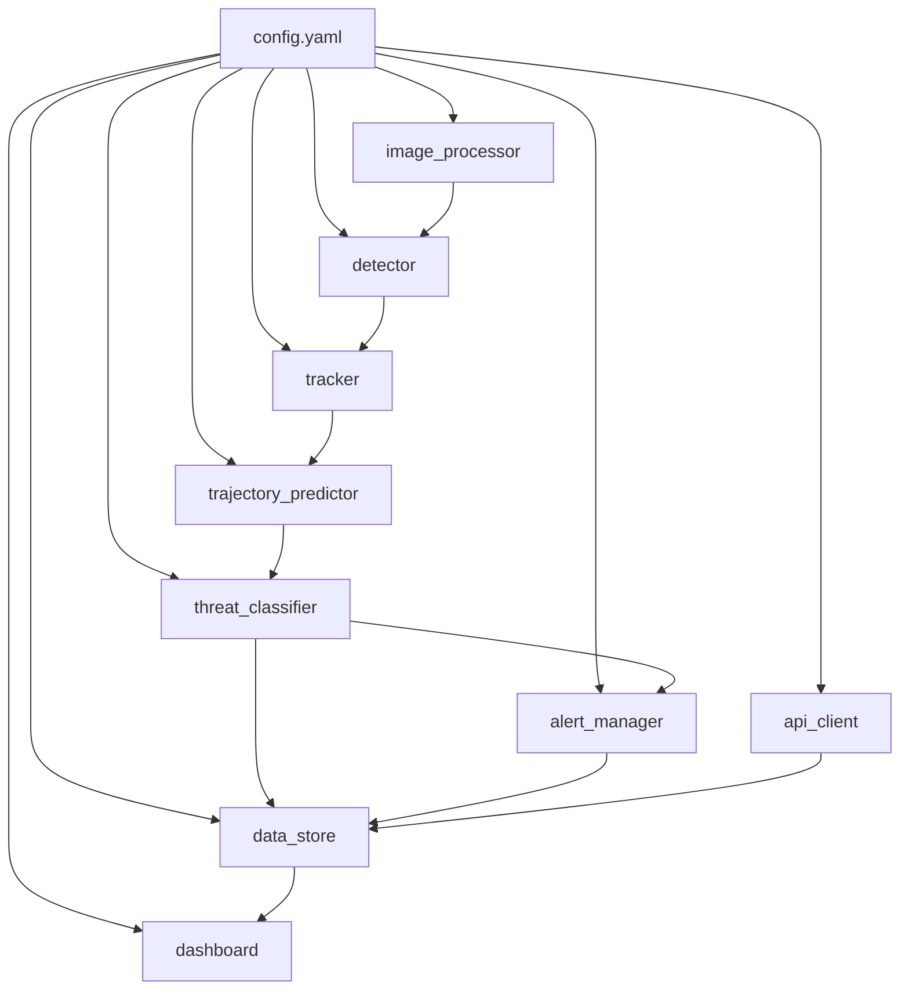
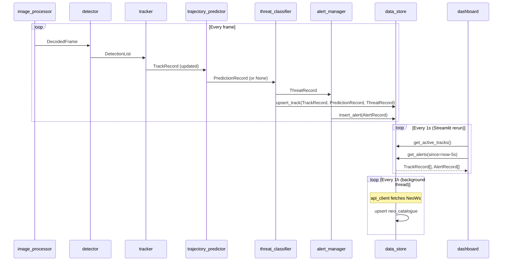

# Design Document: Asteroid Threat Monitor

## Overview

The Asteroid Threat Monitor is a Python-only, modular AI pipeline that ingests telescope image streams, detects and tracks asteroids using computer vision and deep learning, predicts trajectories using orbital mechanics, classifies threat levels, and presents findings through a Streamlit dashboard with real-time alerts.

The system is designed around a linear data-flow pipeline where each module consumes a well-defined data contract from the previous stage and emits a well-defined record to the next. All modules are independently testable via a CLI entry point. Configuration is centralised in a single YAML file.

### Technology Stack

| Concern | Choice |
|---|---|
| Dashboard | Streamlit |
| Image processing | OpenCV |
| Detection | YOLOv5/v8 or custom CNN (ONNX / PyTorch) |
| Tracking | Kalman Filter (filterpy) or optical flow (OpenCV) |
| Trajectory prediction | Orbital mechanics (poliastro / custom) + optional LSTM (PyTorch) |
| Threat classification | Rule-based classifier |
| Alerts | Streamlit visual + SMTP email + optional SMS (Twilio) |
| Persistence | SQLite (default) or PostgreSQL (psycopg2 / SQLAlchemy) |
| External API | NASA NeoWs (optional) |
| Config | PyYAML |

---

## Architecture

### High-Level Pipeline



### Module Dependency Graph



### Process Model

The pipeline runs as a single Python process. The main loop iterates over frames. Each module is called synchronously in sequence. The dashboard runs in a separate Streamlit process and reads from the shared data store. Alert delivery (email/SMS) is dispatched via a background thread pool to avoid blocking the main pipeline.

```
main loop:
  frame = image_processor.next_frame()
  detections = detector.detect(frame)
  tracks = tracker.update(detections, frame)
  for track in tracks:
      prediction = trajectory_predictor.predict(track)
      threat = threat_classifier.classify(track, prediction)
      alert_manager.evaluate(threat)
      data_store.upsert_track(track, prediction, threat)
```

---

## Components and Interfaces

### image_processor

Responsibility: ingest raw image sources, decode frames to standardised RGB arrays.

```python
class ImageProcessor:
    def __init__(self, config: ImageProcessorConfig): ...
    def next_frame(self) -> DecodedFrame | None:
        """Returns next decoded frame or None when stream is exhausted."""
    def close(self) -> None: ...
```

Supported sources (selected by `source_type` in config):
- `directory` — sorted by filename/timestamp
- `video` — OpenCV VideoCapture
- `rtsp` / `http` — OpenCV VideoCapture with URL
- `fits` — astropy.io.fits → numpy array

### detector

Responsibility: run the deep learning model on a decoded frame and return bounding boxes.

```python
class Detector:
    def __init__(self, config: DetectorConfig): ...
    def detect(self, frame: DecodedFrame) -> DetectionList: ...
```

Model loading strategy:
- YOLO v5/v8: loaded via `ultralytics` or `torch.hub`
- Custom CNN: loaded via `onnxruntime` (ONNX) or `torch.load` (PyTorch)
- Model path and format specified in config

### tracker

Responsibility: associate detections across frames, maintain track history, compute physical parameters.

```python
class Tracker:
    def __init__(self, config: TrackerConfig): ...
    def update(self, detections: DetectionList, frame: DecodedFrame) -> list[TrackRecord]: ...
```

Kalman Filter state vector: `[x, y, vx, vy, w, h]` (centroid + velocity + bounding box size).

Association: Hungarian algorithm (scipy.optimize.linear_sum_assignment) on IoU cost matrix.

### trajectory_predictor

Responsibility: forecast future asteroid positions from track history.

```python
class TrajectoryPredictor:
    def __init__(self, config: TrajectoryConfig): ...
    def predict(self, track: TrackRecord) -> PredictionRecord | None:
        """Returns None if track has fewer than 20 samples."""
```

### threat_classifier

Responsibility: apply classification rules to prediction results.

```python
class ThreatClassifier:
    def classify(self, track: TrackRecord, prediction: PredictionRecord) -> ThreatRecord: ...
```

### alert_manager

Responsibility: evaluate threat records and dispatch notifications.

```python
class AlertManager:
    def __init__(self, config: AlertConfig): ...
    def evaluate(self, threat: ThreatRecord) -> None: ...
```

Deduplication: in-memory dict `{(track_id, threat_level): last_alert_utc}`.

### data_store

Responsibility: persist all records; provide query interface for dashboard.

```python
class DataStore:
    def __init__(self, config: DataStoreConfig): ...
    def upsert_track(self, track: TrackRecord, prediction: PredictionRecord | None, threat: ThreatRecord) -> None: ...
    def get_active_tracks(self) -> list[TrackRecord]: ...
    def get_track_history(self, track_id: str, limit: int = 100) -> list[PositionSample]: ...
    def get_alerts(self, since: datetime) -> list[AlertRecord]: ...
    def get_neo_catalogue(self) -> list[NeoRecord]: ...
```

### api_client

Responsibility: fetch NASA NeoWs data on a schedule and annotate matching tracks.

```python
class ApiClient:
    def __init__(self, config: ApiConfig, data_store: DataStore): ...
    def run_scheduled_fetch(self) -> None: ...
```

### dashboard

Responsibility: Streamlit app that reads from data_store and renders the UI.

Entry point: `streamlit run src/dashboard.py`

---

## Data Models

All inter-module records are Python dataclasses (or TypedDicts). They form the internal data contract (Requirement 12.2).

### DecodedFrame

```python
@dataclass
class DecodedFrame:
    frame_id: str           # unique identifier (filename or sequence number)
    timestamp: datetime     # UTC time of capture
    rgb_array: np.ndarray   # shape (H, W, 3), dtype uint8
    source: str             # source path or URL
```

### Detection

```python
@dataclass
class Detection:
    bbox: tuple[int, int, int, int]  # (x1, y1, x2, y2) in pixels
    confidence: float                # [0.0, 1.0]
    frame_id: str
```

### DetectionList

```python
DetectionList = list[Detection]
```

### PositionSample

```python
@dataclass
class PositionSample:
    frame_id: str
    timestamp: datetime
    centroid_x: float       # pixels
    centroid_y: float       # pixels
    bbox: tuple[int, int, int, int]
    velocity_px: tuple[float, float]   # (vx, vy) pixels/frame
    velocity_kms: float | None         # km/s, None if scale unknown
    angular_diameter_arcsec: float | None
    distance_au: float | None
    approx_flag: bool       # True if FOV scale not configured
```

### TrackRecord

```python
@dataclass
class TrackRecord:
    track_id: str
    status: Literal["active", "lost"]
    created_at: datetime
    updated_at: datetime
    frames_since_last_detection: int
    history: list[PositionSample]   # rolling, max 100 entries
    neo_catalogue_id: str | None
    neo_name: str | None
```

### PredictionRecord

```python
@dataclass
class PredictionRecord:
    track_id: str
    computed_at: datetime
    horizon_hours: float
    forecast_steps: list[ForecastStep]
    closest_approach_au: float
    closest_approach_time: datetime
    intersects_earth_corridor: bool
    model_used: Literal["orbital", "lstm", "blended"]
```

### ForecastStep

```python
@dataclass
class ForecastStep:
    time_offset_hours: float
    position_au: tuple[float, float, float]   # (x, y, z) heliocentric
    confidence_interval_au: float
```

### ThreatRecord

```python
@dataclass
class ThreatRecord:
    track_id: str
    threat_level: Literal["Safe", "Potentially_Hazardous", "Dangerous"]
    previous_threat_level: str | None
    closest_approach_au: float
    velocity_kms: float | None
    changed_at: datetime | None   # None if level unchanged
    evaluated_at: datetime
```

### AlertRecord

```python
@dataclass
class AlertRecord:
    alert_id: str           # UUID
    track_id: str
    threat_level: str
    closest_approach_au: float
    velocity_kms: float | None
    created_at: datetime
    channels: list[str]     # ["visual", "email", "sms"]
    delivery_status: dict[str, str]   # channel -> "sent" | "failed" | "suppressed"
```

### NeoRecord

```python
@dataclass
class NeoRecord:
    neo_id: str             # NASA catalogue ID
    name: str
    absolute_magnitude: float
    estimated_diameter_km: tuple[float, float]   # (min, max)
    is_potentially_hazardous: bool
    close_approach_date: date
    miss_distance_au: float
    relative_velocity_kms: float
    fetched_at: datetime
```

---

## Database Schema

### SQLite / PostgreSQL (via SQLAlchemy)

```sql
-- Tracks
CREATE TABLE tracks (
    track_id        TEXT PRIMARY KEY,
    status          TEXT NOT NULL CHECK (status IN ('active', 'lost')),
    created_at      TIMESTAMP NOT NULL,
    updated_at      TIMESTAMP NOT NULL,
    closed_at       TIMESTAMP,
    neo_catalogue_id TEXT,
    neo_name        TEXT
);

-- Position samples (one row per frame per track)
CREATE TABLE position_samples (
    id              INTEGER PRIMARY KEY AUTOINCREMENT,
    track_id        TEXT NOT NULL REFERENCES tracks(track_id),
    frame_id        TEXT NOT NULL,
    timestamp       TIMESTAMP NOT NULL,
    centroid_x      REAL NOT NULL,
    centroid_y      REAL NOT NULL,
    bbox_x1         INTEGER, bbox_y1 INTEGER, bbox_x2 INTEGER, bbox_y2 INTEGER,
    velocity_px_x   REAL, velocity_px_y REAL,
    velocity_kms    REAL,
    angular_diameter_arcsec REAL,
    distance_au     REAL,
    approx_flag     BOOLEAN NOT NULL DEFAULT FALSE
);

-- Predictions
CREATE TABLE predictions (
    id              INTEGER PRIMARY KEY AUTOINCREMENT,
    track_id        TEXT NOT NULL REFERENCES tracks(track_id),
    computed_at     TIMESTAMP NOT NULL,
    horizon_hours   REAL NOT NULL,
    closest_approach_au REAL NOT NULL,
    closest_approach_time TIMESTAMP NOT NULL,
    intersects_earth_corridor BOOLEAN NOT NULL,
    model_used      TEXT NOT NULL,
    forecast_json   TEXT NOT NULL   -- JSON array of ForecastStep
);

-- Threat history
CREATE TABLE threat_history (
    id              INTEGER PRIMARY KEY AUTOINCREMENT,
    track_id        TEXT NOT NULL REFERENCES tracks(track_id),
    threat_level    TEXT NOT NULL,
    previous_level  TEXT,
    closest_approach_au REAL NOT NULL,
    velocity_kms    REAL,
    changed_at      TIMESTAMP,
    evaluated_at    TIMESTAMP NOT NULL
);

-- Alerts
CREATE TABLE alerts (
    alert_id        TEXT PRIMARY KEY,
    track_id        TEXT NOT NULL REFERENCES tracks(track_id),
    threat_level    TEXT NOT NULL,
    closest_approach_au REAL NOT NULL,
    velocity_kms    REAL,
    created_at      TIMESTAMP NOT NULL,
    channels        TEXT NOT NULL,      -- JSON array
    delivery_status TEXT NOT NULL       -- JSON object
);

-- NEO catalogue cache
CREATE TABLE neo_catalogue (
    neo_id          TEXT PRIMARY KEY,
    name            TEXT NOT NULL,
    absolute_magnitude REAL,
    diameter_min_km REAL,
    diameter_max_km REAL,
    is_potentially_hazardous BOOLEAN NOT NULL,
    close_approach_date DATE,
    miss_distance_au REAL,
    relative_velocity_kms REAL,
    fetched_at      TIMESTAMP NOT NULL
);
```

Indexes:
```sql
CREATE INDEX idx_position_samples_track_id ON position_samples(track_id);
CREATE INDEX idx_position_samples_timestamp ON position_samples(timestamp);
CREATE INDEX idx_threat_history_track_id ON threat_history(track_id);
CREATE INDEX idx_alerts_created_at ON alerts(created_at);
```

---

## Key Algorithms

### Kalman Filter (Tracker)

State vector: `x = [cx, cy, vx, vy, w, h]` where `(cx, cy)` is bounding box centroid, `(vx, vy)` is velocity in pixels/frame, `(w, h)` is bounding box dimensions.

Transition matrix (constant velocity model):
```
F = [[1, 0, 1, 0, 0, 0],
     [0, 1, 0, 1, 0, 0],
     [0, 0, 1, 0, 0, 0],
     [0, 0, 0, 1, 0, 0],
     [0, 0, 0, 0, 1, 0],
     [0, 0, 0, 0, 0, 1]]
```

Measurement matrix (observe centroid and size):
```
H = [[1, 0, 0, 0, 0, 0],
     [0, 1, 0, 0, 0, 0],
     [0, 0, 0, 0, 1, 0],
     [0, 0, 0, 0, 0, 1]]
```

Process noise `Q` and measurement noise `R` are configurable. Implementation uses `filterpy.kalman.KalmanFilter`.

Track association uses the Hungarian algorithm on a cost matrix where cost = 1 - IoU(predicted_bbox, detected_bbox). Pairs with IoU < configurable threshold are rejected (new track created).

### Orbital Mechanics (Trajectory_Predictor)

Given a track with at least 20 position samples and estimated physical parameters:

1. Convert pixel positions to angular coordinates using plate scale (arcsec/pixel).
2. Fit a Keplerian orbit to the angular position time series using a least-squares solver (scipy.optimize.minimize or poliastro's orbit fitting).
3. Propagate the fitted orbit forward using Kepler's equation for the configured time horizon.
4. Compute closest approach distance to Earth's position (from astropy's solar system ephemeris).

When LSTM is configured:
- Input: last N position samples as a normalised time series
- Output: delta corrections to the orbital mechanics forecast
- Blended output: `position = orbital_position + lstm_delta * blend_weight`

Confidence interval: derived from the residuals of the orbit fit. Larger residuals → wider interval.

### Threat Classification Rules

```
if closest_approach_au < 0.002 AND velocity_kms > 10:
    threat_level = "Dangerous"
elif 0.002 <= closest_approach_au <= 0.05:
    threat_level = "Potentially_Hazardous"
else:
    threat_level = "Safe"
```

These thresholds are configurable in the YAML file.

---

## Streamlit Dashboard Layout

```
┌─────────────────────────────────────────────────────────────────┐
│  ASTEROID THREAT MONITOR          [connection status indicator]  │
├──────────────┬──────────────────────────────────────────────────┤
│  SIDEBAR     │  MAIN AREA                                        │
│              │                                                   │
│  Filters:    │  [Live Frame View]          [Risk Summary Table]  │
│  - Date range│  st.image() with bbox       Track ID | Level      │
│  - Threat    │  overlays (OpenCV drawn)    ---------|----------  │
│    level     │                             TRK-001  | 🔴 Danger  │
│  - Track ID  │                             TRK-002  | 🟡 PH      │
│              │                             TRK-003  | 🟢 Safe    │
│  [Select     ├─────────────────────────────────────────────────  │
│   Track]     │  [Selected Track Panel]                           │
│              │  Velocity | Distance | Size | Direction           │
│  [Settings]  │  ─────────────────────────────────────────────   │
│              │  [Speed Chart]  [Distance Chart]  [Trajectory]    │
│              │  st.plotly_chart (time series)   (3D Plotly)      │
│              ├─────────────────────────────────────────────────  │
│              │  [Alert Log]  [Historical Data Log]               │
│              │  Filterable table via st.dataframe                │
└──────────────┴──────────────────────────────────────────────────┘
```

Key Streamlit patterns:
- `st.empty()` container updated in a `while True` loop with `time.sleep(1)` for live frame refresh
- `st.session_state` for selected track ID and filter state
- `st.sidebar` for all filter controls
- `st.plotly_chart(use_container_width=True)` for all charts
- `st.metric()` for velocity, distance, size KPIs
- `st.dataframe()` with column config for the historical log
- Alert banner: `st.error()` / `st.warning()` rendered at top of main area

---

## Inter-Module Data Flow



---

## Configuration Schema

```yaml
# config.yaml — all fields with defaults shown

image_processor:
  source_type: directory          # directory | video | rtsp | http
  source_path: ./data/frames
  supported_formats: [fits, jpeg, png, tiff]
  decode_timeout_ms: 50

detector:
  model_type: yolov8              # yolov8 | yolov5 | onnx | pytorch
  model_path: ./models/asteroid_yolov8.pt
  confidence_threshold: 0.5
  input_resolution: [640, 640]

tracker:
  algorithm: kalman               # kalman | optical_flow
  max_lost_frames: 10
  max_history: 100
  min_iou_threshold: 0.3
  pixel_distance_threshold: 20
  fov_scale_arcsec_per_pixel: null   # null = approximate mode
  plate_scale_arcsec_per_pixel: null

trajectory_predictor:
  min_samples: 20
  horizon_hours: 72
  earth_corridor_au: 0.05
  lstm_model_path: null           # null = disabled
  lstm_blend_weight: 0.3

threat_classifier:
  dangerous_distance_au: 0.002
  dangerous_velocity_kms: 10.0
  hazardous_distance_au: 0.05

alert_manager:
  deduplication_window_seconds: 300
  retry_attempts: 3
  retry_interval_seconds: 10
  email:
    enabled: false
    smtp_host: smtp.example.com
    smtp_port: 587
    sender: alerts@example.com
    recipients: []
    username: ""
    password: ""
  sms:
    enabled: false
    provider: twilio
    account_sid: ""
    auth_token: ""
    from_number: ""
    to_numbers: []

data_store:
  backend: sqlite                 # sqlite | postgresql
  sqlite_path: ./data/asteroid_monitor.db
  postgresql_dsn: ""
  retention_days: 90

api_client:
  enabled: false
  nasa_neows_api_key: DEMO_KEY
  fetch_interval_hours: 1
  max_requests_per_hour: 10
  match_tolerance_au: 0.01

dashboard:
  refresh_interval_seconds: 1
  port: 8501
```

---

## Error Handling

| Scenario | Module | Behaviour |
|---|---|---|
| Frame decode failure | image_processor | Log error + frame ID, skip frame, continue |
| No detections in frame | detector | Return empty DetectionList, log frame as processed |
| Track lost (N frames) | tracker | Mark status="lost", emit final TrackRecord |
| Insufficient samples for prediction | trajectory_predictor | Return None, log track_id + sample count |
| DB write failure | data_store | Log failure + record ID, queue for retry |
| Alert delivery failure | alert_manager | Retry up to 3×, log final failure |
| External API unreachable | api_client | Log failure, use cached data, continue pipeline |
| Config file missing/malformed | main | Log descriptive error, exit with code 1 |
| Config value out of range | main | Log descriptive error per field, exit with code 1 |
| Unhandled module exception | main loop | Log full stack trace, continue next frame |
| Dashboard feed interrupted >5s | dashboard | Display connection-lost banner with last frame timestamp |

---

## Testing Strategy

### Dual Testing Approach

Both unit tests and property-based tests are required. They are complementary:
- Unit tests verify specific examples, integration points, and error conditions.
- Property-based tests verify universal correctness across randomised inputs.

### Unit Tests

Focus areas:
- `image_processor`: correct decoding of each supported format; error handling on corrupt files
- `detector`: confidence threshold filtering; empty detection list on blank frame
- `tracker`: new track creation; track loss after N frames; Hungarian assignment correctness
- `trajectory_predictor`: None returned when < 20 samples; Earth corridor intersection logic
- `threat_classifier`: boundary conditions at 0.002 AU and 0.05 AU; threat level change recording
- `alert_manager`: deduplication window; retry logic; channel mapping
- `data_store`: round-trip write/read for each record type; retention query
- `config`: missing file exits with code 1; invalid value exits with code 1; defaults applied

### Property-Based Tests

Library: **Hypothesis** (Python)

Configuration: minimum 100 examples per test (`@settings(max_examples=100)`).

Tag format in test comments: `Feature: asteroid-threat-monitor, Property {N}: {property_text}`

Each correctness property below is implemented by exactly one property-based test.

---

## Correctness Properties

*A property is a characteristic or behavior that should hold true across all valid executions of a system — essentially, a formal statement about what the system should do. Properties serve as the bridge between human-readable specifications and machine-verifiable correctness guarantees.*

### Property 1: Detection confidence filtering

*For any* decoded frame and any confidence threshold in [0, 1], every detection returned by the detector must have a confidence score greater than or equal to the configured threshold.

**Validates: Requirements 2.2**

### Property 2: Track ID uniqueness and persistence

*For any* sequence of detection lists processed by the tracker, each Track ID assigned during the session must be unique, and once assigned to a track, the same ID must appear in all subsequent TrackRecords for that track until it is marked lost.

**Validates: Requirements 3.2**

### Property 3: Track loss invariant

*For any* track that has not received a matching detection for more than `max_lost_frames` consecutive frames, the tracker must mark that track's status as "lost".

**Validates: Requirements 3.3**

### Property 4: Physical parameter approximation flag

*For any* TrackRecord produced when `fov_scale_arcsec_per_pixel` is not configured, every PositionSample in the record must have `approx_flag = True`.

**Validates: Requirements 4.5**

### Property 5: Trajectory prediction deferral

*For any* TrackRecord with fewer than 20 position samples, the trajectory predictor must return None and must not raise an exception.

**Validates: Requirements 5.5**

### Property 6: Earth corridor intersection consistency

*For any* PredictionRecord, if `intersects_earth_corridor` is True then `closest_approach_au` must be less than or equal to the configured `earth_corridor_au` threshold, and if False then `closest_approach_au` must be greater than the threshold.

**Validates: Requirements 5.2**

### Property 7: Threat classification rule correctness

*For any* PredictionRecord and TrackRecord, the ThreatRecord produced by the classifier must satisfy exactly the documented rules: Dangerous iff `closest_approach_au < 0.002 AND velocity_kms > 10`; Potentially_Hazardous iff `0.002 <= closest_approach_au <= 0.05`; Safe iff `closest_approach_au > 0.05`. Every input must produce exactly one of the three levels.

**Validates: Requirements 6.1, 6.2, 6.3, 6.4**

### Property 8: Threat level change recording

*For any* sequence of ThreatRecords for the same track where the threat level changes, the new ThreatRecord must record the previous level, the new level, and a non-null `changed_at` timestamp. When the level does not change, `changed_at` must be None.

**Validates: Requirements 6.5**

### Property 9: Alert deduplication

*For any* sequence of ThreatRecords for the same track ID and same threat level arriving within the deduplication window, the alert manager must generate at most one alert for that (track_id, threat_level) pair within the window.

**Validates: Requirements 7.7**

### Property 10: Alert severity mapping

*For any* ThreatRecord with level Potentially_Hazardous, the generated AlertRecord must record severity "medium"; for any ThreatRecord with level Dangerous, severity must be "high".

**Validates: Requirements 7.3**

### Property 11: Data store round-trip

*For any* TrackRecord written to the data store, reading it back by track_id must return a record with identical track_id, status, and the same number of position samples.

**Validates: Requirements 9.1**

### Property 12: Configuration defaults applied

*For any* configuration file that omits one or more optional parameters, the loaded configuration object must contain the documented default value for each omitted parameter.

**Validates: Requirements 11.4**

### Property 13: Configuration validation rejects invalid values

*For any* configuration file containing a value outside the documented valid range for any parameter (e.g., confidence_threshold outside [0,1], max_lost_frames < 1), the system must exit with a non-zero status code and log a descriptive error message identifying the invalid field.

**Validates: Requirements 11.3**
